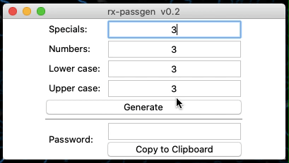

# rx-passgen

It's a python software you can use to generate random passwords

Developed in stock python 3.7.5.

Tested under Windows 10, Linux and MacOS Catalina.

## Features
- Selectable number of special, number, upper case and lower case chars 
- Auto copies the generated password to clipboard
- ASCII chars only

## Screenshots

